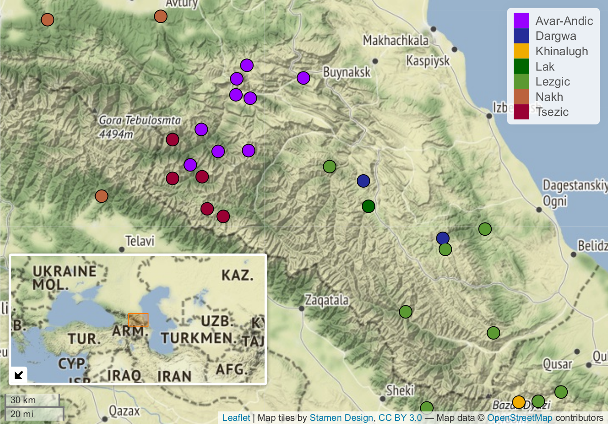
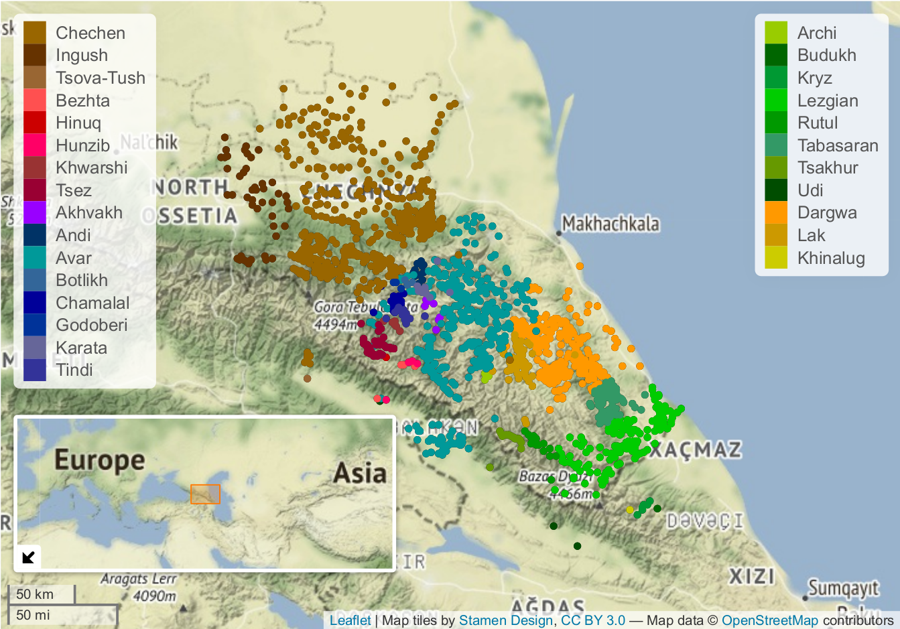

```{r setup, include=FALSE}
# setwd("/home/agricolamz/work/materials/2021.08_SLE/talk")
knitr::opts_chunk$set(echo = FALSE, warning = FALSE, message = FALSE, dev='cairo_pdf')
options(tinytex.verbose = TRUE, digits = 3)
library(tidyverse)
theme_set(theme_bw())

# create qrcode
# library(qrcode)
# png(filename="images/00_qrcode.png", width = 150, height = 150)
# qrcode_gen("https://github.com/agricolamz/2021.09.02_sle_phoneme_inventory_size_and_elevation/raw/master/2021.09.02_sle_mountain_linguistics_moroz_phoneme_inventory_size_and_elevation.pdf")
# dev.off()

library(lingtypology)
data <- read_csv("data/data.csv")
data %>% 
  distinct(glottocode, branch) %>%
  mutate(lang = lang.gltc(glottocode),
         lat = lat.lang(lang),
         long = long.lang(lang)) ->
  data_m

data_m[data_m$lang == "Megeb", 4] <- 42.2528
data_m[data_m$lang == "Megeb", 5] <- 47.0472

data_m[data_m$lang == "Avar", 4] <- 42.74667
data_m[data_m$lang == "Avar", 5] <- 46.65917

data_m[data_m$lang == "Chechen", 4] <- 43.04028
data_m[data_m$lang == "Chechen", 5] <- 45.73028

data_m[data_m$lang == "Ingush", 4] <- 43.026712
data_m[data_m$lang == "Ingush", 5] <- 44.994647

data_m[data_m$lang == "Udi", 4] <- 41.15083
data_m[data_m$lang == "Udi", 5] <- 47.45833

data_m[data_m$lang == "Tsakhur", 4] <- 41.15083
data_m[data_m$lang == "Tsakhur", 5] <- 47.45833

colors <- read_tsv("https://raw.githubusercontent.com/sverhees/master_villages/master/data/meta.csv")

colors %>% 
  distinct(glottocode, lang_color, lang) %>% 
  mutate(lang_color_pale = lang_color) %>% 
  select(-lang_color) %>% 
  bind_rows(tibble(glottocode = "sout3261",
                   lang_color_pale = "#ff9900"))->
  colors

data_m %>% 
  left_join(colors[,-1]) ->
  data_m
```

#  Connection of language diversity to physical environment

## Connection of language diversity to physical environment

There are a lot of work that connects language diversity to physical environment:

* famous and controversial [@everett13] that shows connection between altitude and distribution of ejectives and even propose a hypothesis of the reason of such a correlation
* in [@bentz18] shows that phylogenetic signals correlates with different environmental factors (including altitude)
* a lot of works by Johanna Nichols and summary in [@urban20]

# Prediction of phonological inventory size
## Prediction of phonological inventory size

There are several works [@hay07; @atkinson11] that report connection of phoneme inventory sizes and language population sizes. There are several replies on those works [@maddieson11; @donohue11; @wichmann11; @moran12].


# East Caucasian languages' data

## About East Caucasian phonology

Most East Caucasian (Nakh-Dagestanian) languages are located in the Republic of Dagestan, Chechen Republic and Republic of Ingushetia.

* phonology
    * [@kk90]
    * The indigenous languages of the Caucasus: [@smeets94a], [@smeets94b]
    * Yaziki mira: [@alekseev01] and predecessor projects
    * [@grawunder17]
    * The Oxford Handbook of Languages of the
Caucasus: [@begus21], [@boris21b], [@boris21a]
    * Handbook of Caucasian
Languages: [@koryakov21]
    * and phonological parts in more general descriptions of East Caucasian languages
* historical-comparative phonetics
    * S. M. Gasanova, G. Kh. Ibragimov, P. T. Magomedova, U. A. Meylanova, B. B. Talibov, S. M. Khaydakov, A. E. Alekseev, Ju. D. Desheriev, B. K. Gigineishvili, D. S. Imnaishvili, J. Nichols, S. L. Nikolayev, S. A. Starostin, A. S. Kasyan, N. A. Ardoteli, O. A. Mudrak

## Languages
\begin{multicols}{3}
\begin{itemize}

\item Nakh
\begin{itemize}
  \item Chechen
  \item Ingush
  \item Tsova-Tush (Batsbi)
\end{itemize}
\item Tsezic (Didoic)
\begin{itemize}
\item Tsez
\item Hinuq
\item Bezhta
\item Hunzib
\item Khwarshi-Inkhoqwari
\end{itemize}
\item Avar–Andic
\begin{itemize}
  \item Avar
  \item Andi
  \item Botlikh
  \item Godoberi
  \item Chamalal
  \item Karata
  \item Tindi
  \item Bagvalal
  \item Akhvakh
\end{itemize}
\item Dargwa
\item Lak
\item Lezgic
\begin{itemize}
\item Archi
\item Tabasaran
\item Aghul
\item Lezgian
\item Udi
\item Budukh
\item Kryz
\item Rutul
\item Tsakhur
\end{itemize}
\item Khinalug
\end{itemize}
\end{multicols}


## Languages not present in [@kk90]

\begin{multicols}{3}
\begin{itemize}
\item \alert{Nakh}
\begin{itemize}
  \item \alert{Chechen}
  \item \alert{Ingush}
  \item \alert{Tsova-Tush (Batsbi)}
\end{itemize}
\item Tsezic (Didoic)
\begin{itemize}
\item Tsez
\item Hinuq
\item Bezhta
\item Hunzib
\item Khwarshi-Inkhoqwari
\end{itemize}
\item Avar–Andic
\begin{itemize}
  \item Avar
  \item Andi
  \item \alert{Botlikh}
  \item \alert{Godoberi}
  \item \alert{Karata}
  \item Chamalal
  \item Tindi
  \item \alert{Bagvalal}
  \item Akhvakh
\end{itemize}
\item Dargwa
\item Lak
\item Lezgic
\begin{itemize}
\item Archi
\item Tabasaran
\item Aghul
\item Lezgian
\item Udi
\item Budukh
\item Kryz
\item Rutul
\item Tsakhur
\end{itemize}
\item Khinalug
\end{itemize}
\end{multicols}

## Languages not present in [@kk90]

* Andic, Bagvalal [@kibrik01]
* Andic, Botlikh [@alexeyev21]
* Andic, Godoberi [@moroz21]
* Andic, Karata [@magomedbekova71]
* Dargwa, Mehweb [@moroz19]
* Nakh, Chechen [@nichols94a]
* Nakh, Ingush [@nichols94b]
* Nakh, Tsova-Tush [@holisky94]

## Phonological peculiarities

* East Caucasian consonant systems are more or less typical
    * except uvular and laryngeal consonants
    * except ejective consonants
    * except laterals in Avar-Andic and Tsezic branches
    * except labialization
    * except gemination
* East Caucasian vowel systems are typical

## Phonological data

`r nrow(data)` $\times$ `r ncol(data)` [table](https://raw.githubusercontent.com/agricolamz/2020.10.21_HSE_Phonology_of_East_Caucasian_languages/master/data/data.csv) with the following columns:

* `id`
* `branch`
* `language`
* `segment IPA`
* `segment sorce`
* `source`
* `sound type`
* `comments`
* `glottocode`

## Phonological data

`r nrow(data)` $\times$ `r ncol(data)` [table](https://raw.githubusercontent.com/agricolamz/2020.10.21_HSE_Phonology_of_East_Caucasian_languages/master/data/data.csv) with the following columns:

* `id` -- 1407
* `branch` -- Lezgic (possible values are  `r paste0(unique(data$branch), collapse = ", ")`)
* `language` -- Tsakhur
* `segment IPA` -- tʃː
* `segment sorce` -- \v{\=c}
* `source` -- [Kibrik, Kodzasov 1990: 343-344]
* `sound type` -- consonant (possible values are `r paste0(unique(data$sound_type), collapse = ", ")`)
* `comments` --  rare sound
* `glottocode` -- [tsak1249](https://glottolog.org/resource/languoid/id/tsak1249)

## Geographic data [@moroz20_villages]

```{r, eval = FALSE}
map.feature(lang = data_m$lang,
            features = data_m$branch, 
            latitude = data_m$lat,
            longitude = data_m$long,
            color = data_m$lang_color_pale,
            width = 7,
            tile = "Stamen.Terrain",
            minimap = TRUE, 
            minimap.position = "bottomleft",
            minimap.width = 300)
```



created with `lingtypology` [@moroz17]

## Geographic Data [@moroz20_villages]

```{r, eval = FALSE}
all_villages <- read_csv("https://raw.githubusercontent.com/sverhees/master_villages/master/data/villages.csv")

all_villages %>% 
  filter(!kutans,
         !is.na(lat),
         !str_detect(lang, "Tat|Kumyk|Nogai|Azerbaijani|Georgian")) ->
  all_villages

all_villages %>% 
  filter(str_detect(lang, "Dargwa|Lak|Archi|Tabasaran|Agul|Lezgian|Udi|Budukh|Kryz|Rutul|Tsakhur|Khinalug")) %>% 
  mutate(lang2 = str_replace(lang, "Dargwa", "North Dargwa"),
         lang = str_replace(lang, "Agul", "Aghul"),
         lang = factor(lang, levels = c("Agul", 
                                        "Archi",
                                        "Budukh",
                                        "Kryz",
                                        "Lezgian",
                                        "Rutul",
                                        "Tabasaran",
                                        "Tsakhur",
                                        "Udi",
                                        "Dargwa",
                                        "Lak",
                                        "Khinalug"))) ->
  first_map

all_villages %>% 
  filter(str_detect(lang, "Chechen|Ingush|Bats|Tsez|Hinuq|Bezhta|Hunzib|Khwarshi|Avar|Andi|Botlikh|Godoberi|Karata|Chamalal|Tindi|Bagvalal|Akhvakh")) %>% 
  mutate(lang2 = str_replace(lang, "Khwarshi", "Khwarshi-Inkhoqwari"),
         lang = str_replace(lang, "Bats", "Tsova-Tush"),
         lang = factor(lang, levels = c("Chechen",
                                        "Ingush",
                                        "Tsova-Tush",
                                        "Bezhta",
                                        "Hinuq",
                                        "Hunzib",
                                        "Khwarshi",
                                        "Tsez",
                                        "Akhvakh",
                                        "Andi",
                                        "Avar",
                                        "Botlikh",
                                        "Chamalal",
                                        "Godoberi",
                                        "Karata",
                                        "Tindi")))->
  second_map


map.feature(lang = first_map$lang2,
            features = first_map$lang, 
            latitude = first_map$lat,
            longitude = first_map$lon,
            color = c("#00cc66", # "Agul", 
                      "#99cc00", # "Archi",
                      "#006600", # "Budukh",
                      "#009933", # "Kryz",
                      "#00cc00", # "Lezgian",
                      "#009900", # "Rutul",
                      "#339966", # "Tabasaran",
                      "#669900", # "Tsakhur",
                      "#004d00", # "Udi",
                      "#ff9900", # "Dargwa",
                      "#cc9900", # "Lak",
                      "#cccc00"  # "Khinalug"
            ),
            width = 3,
            tile = "Stamen.Terrain") %>% 
  map.feature(lang = second_map$lang2,
            features = second_map$lang, 
            latitude = second_map$lat,
            longitude = second_map$lon,
            color = c("#996600", # Chechen
                      "#663300", # Ingush
                      "#996633", # Tsova-Tush
                      "#ff5050", # "Bezhta",
                      "#cc0000", # "Hinuq",
                      "#ff0066", # "Hunzib",
                      "#993333", # "Khwarshi",
                      "#990033", # "Tsez",
                      "#9900ff", # "Akhvakh",
                      "#003366", # "Andi",
                      "#009999", # "Avar",
                      "#336699", # "Botlikh",
                      "#000099", # "Chamalal",
                      "#003399", # "Godoberi"
                      "#666699", # "Karata",
                      "#333399"), # "Tindi"
            width = 3,
            tile = "Stamen.Terrain", 
            legend.position = "topleft",
            minimap = TRUE, 
            minimap.position = "bottomleft",
            minimap.width = 300, 
            minimap.height = 120,
            pipe.data = .)
```



created with `lingtypology` [@moroz17]

## Elevation Data

Elevation for this data was retrieved using the GLOBE digital elevation model from the National Centers for Environmental Information (after [@urban21]).

# On the correlation between phoneme inventory size and elevation

## East Caucasian data

```{r}
read_csv("https://raw.githubusercontent.com/agricolamz/2020.10.21_HSE_Phonology_of_East_Caucasian_languages/master/data/data.csv") %>% 
  count(glottocode, sound_type) %>% 
  pivot_wider(names_from = sound_type, values_from = n) ->
  phon_inventories

read_csv("https://raw.githubusercontent.com/sverhees/master_villages/master/data/villages.csv") %>% 
  filter(!kutans) %>% 
  left_join(read_tsv("https://raw.githubusercontent.com/sverhees/master_villages/master/data/meta.csv"), by = "lang") %>%
  left_join(phon_inventories) %>% 
  dplyr::select(glottocode, lang, elevation, elevation_ETOPO1, consonant, vowel, diphthong) %>% 
  group_by(glottocode, lang, consonant, vowel, diphthong) %>% 
  summarise(el = mean(elevation_ETOPO1, na.rm = TRUE)) %>% 
  mutate(phonemes = consonant + vowel,
         lang = ifelse(lang == "Bats", "Tsova-Tush", lang)) %>%
  filter(!is.na(phonemes)) %>% 
  mutate(phonemes = ifelse(is.na(diphthong), phonemes, phonemes + diphthong)) %>% 
  ungroup() %>% 
  dplyr::select(glottocode, lang, el, phonemes) ->
  result

tibble(glottocode = c("kumy1244", "nort2697", "nucl1302", "nucl1235"),
       lang = c("Kumyk", "North Azerbaijani", "Georgian", "Eastern Armenian"),
       el = c(504, 266, 1439, 1872),
       phonemes = c(31, 34, 34, 37)) %>% 
  bind_rows(result) ->
  result

result %>% 
  ggplot(aes(el, phonemes, label = lang))+
  #geom_smooth(method = "glm", method.args = list(family = "poisson"), se = FALSE)+
  geom_point()+
  ggrepel::geom_text_repel(size = 6)+
  labs(x = "mean elevation (m)", y = "inventory size") 
```

## Negative binomial regression model (East Caucasian languages)

```{r, include=FALSE}
library(MASS)
result %>% 
  glm.nb(formula = phonemes~el) ->
  daghestan_fit

summary(daghestan_fit)
round(coefficients(daghestan_fit), 4)
```

$$\text{number of phonemes} = \exp\left[ 3.7525+0.0002\times \text{elevation}\right]$$

```{r, fig.height=6}
library(ggeffects)
plot(ggeffect(daghestan_fit, terms = "el"))+
  labs(x = "mean elevation (m)", y = "inventory size", 
       title = "Phoneme inventories are bigger in the highlands of Dagestan (model predictions)",
       caption = "based on the sample of East Caucasian languages")+
  theme(text = element_text(size = 14)) 
```


## PHOIBLE data [@phoible]

```{r phoible, cache=TRUE}
library(lingtypology)

ph <- phoible.feature()

read_csv("data/phoible.csv") %>% 
  mutate(family = aff.lang(lang.gltc(glottocode)),
         family = str_remove(family, ",.*")) ->
  selected

ph %>% 
  filter(segmentclass != tone) %>% 
  group_by(inventoryid, glottocode) %>% 
  summarise(n = n()) %>% 
  full_join(selected) ->
  phoible_results

phoible_results %>% 
  ggplot(aes(elevation, n))+
  geom_hex()+
  #geom_smooth(method = "glm", method.args = list(family = "poisson"), se = FALSE)+
  scale_fill_gradient(high="darkred", low="lightblue")+
  labs(x = "elevation (m)", y = "inventory size")
```

## Negative binomial regression model (PHOIBLE)
### elevation is not statistically significant

$$\text{number of phonemes} = \exp\left[3.3659+0.0273\times \text{elevation}\right]$$

```{r, fig.height=6}
library(lme4)
library(lmerTest)

phoible_results %>% 
  mutate(elevation = elevation/1000) %>% 
  glmer.nb(formula = n~elevation+(1+elevation|macroarea) + (1|family)) ->
  phoible_fit

library(ggeffects)
plot(ggpredict(phoible_fit, terms = "elevation"))+
  labs(x = "elevation (m)", y = "inventory size", 
       subtitle = "negative binomial mixed effects model regression: \ninventory size ~ elevation + (1+elevation|macroarea) + (1|family)",
       caption = "based on the sample of PHOIBLE languages [Moran et. al. 2014]")+
  scale_x_continuous(breaks  = c(0, 2, 4, 6), 
                     labels = c(0, 2000, 4000, 6000))+
  theme(text = element_text(size = 14))
```


# Discussion

## False? results:

As a result, I discovered a local effect in Dagestan that should be compared with other mountain areas (see e. g. affricate-rich languages in the Eastern Himalayan and in the Hindukush linguistic areas [@nikolaev18]). If they show similar results, it would confirm Johanna Nichols' [-@nichols13] hypothesis that mountain areas provide isolation and "isolation favors complexity". \pause

* However mountains can be different: see the Altai argument in [@urban20];
* It make sense to think more about other obstacles (e. g. rivers and travel costs, see [Allassonnière-Tang, Her this conference], [Koile et al. forthcoming]);
* Ignoring social and historical changes in language comunities leads to oversimplification: see about multilingualism patterns and their collapse in Dagestan [@dobrushina19] and Urban's note during this conference;
* Pure altitude values are useless: as Mark said, we can't take this result and try to  predict something in e. g. South America.

## To future researcher

* I personally do not believe that the results that I obtained are any different from spurious correlations (like the amount of pirates and Earth's temperature). \pause 
* My model marks elevation as a statistically significant predictor of number of segments in a language, but it is not the same about pure vowel nor consonant inventory size. \pause 
* Despite the fact that Johanna Nichols has proposed general model for language dynamics in mountain areas, I think we need more prediction oriented theory of Mountain linguistics. \pause 
* ... and research preregistration!

## {}

\LARGE Thank you for your attention!

# References {.allowframebreaks}
